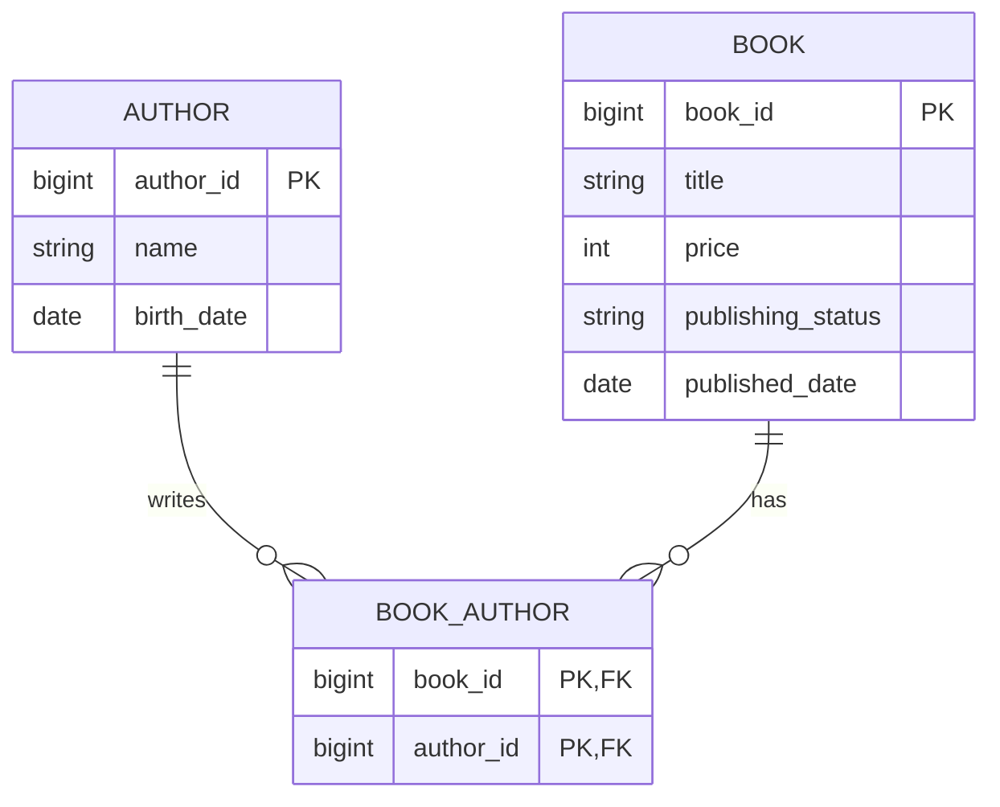

# 書籍管理システムのバックエンドAPI  
- 技術要件
  - 言語:Kotlin
  - フレームワーク:Spring Boot, jOOQ
- 必要な機能
  - 書籍と著者の情報をRDBに登録・更新できる機能
  - 著者に紐づく本を取得できる機能
- 書籍の属性
  - タイトル
  - 価格（0以上であること）
  - 著者（最低1人の著者を持つ。複数の著者を持つことが可能）
  - 出版状況（未出版、出版済み。出版済みステータスのものを未出版には変更できない）
- 著者の属性
  - 名前
  - 生年月日（現在日以前であること）
  - 著者も複数の書籍を執筆できる

---
  
### 技術スタック
| 項目 | 内容 |
|------|------|
| 言語 | Kotlin |
| フレームワーク | Spring Boot |
| O/R マッパー | jOOQ |
| DB | PostgreSQL 16 |
| Java | 21 |
| マイグレーション | Flyway |
| コンテナ | Docker Compose |

---

### ER図


---

### 環境セットアップ
#### 1. DB 起動
```bash
docker compose up -d
```
#### 2. アプリを起動
通常の Spring Boot アプリとして起動できます。  
※初回実行時のみマイグレーションが実行されDBが生成されます
#### 3. 単体テストを実行
```bash
gradle test
```

---

### 詳細なAPI仕様
詳細なAPI仕様と実行サンプルは以下のswaggerにて記載しています  
[book-api(swagger)](https://tomoki-ueno.github.io/book-api/swagger/)