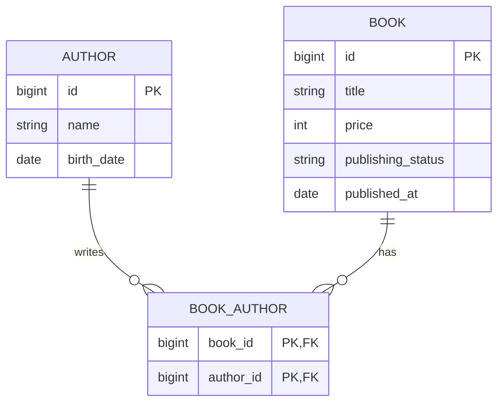

# 書籍管理システムのバックエンドAPI  
- 技術要件
  - 言語:Kotlin
  - フレームワーク:Spring Boot, jOOQ
- 必要な機能
  - 書籍と著者の情報をRDBに登録・更新できる機能
  - 著者に紐づく本を取得できる機能
- 書籍の属性
  - タイトル
  - 価格（0以上であること）
  - 著者（最低1人の著者を持つ。複数の著者を持つことが可能）
  - 出版状況（未出版、出版済み。出版済みステータスのものを未出版には変更できない）
- 著者の属性
  - 名前
  - 生年月日（現在日以前であること）
  - 著者も複数の書籍を執筆できる
---
### ER図
